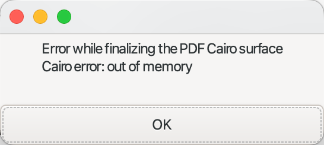

## Paper configuration in Xournalpp 

it is divided into two main parts:

*   **Line Configuration:** This part allows you to configure the paper's horizontal and vertical lines, including their spacing and color. These settings are managed within the `papertemplates.ini` file.
*   **paper Layout:** This part deals with applying the desired paper size and background color. Further configuration is required through the menu bar by navigating to `Journal > Configure paper Template`.

## Resolving "Cairo error: out of memory" in Xournalpp with Chinese Annotations



When exporting PDFs from Xournalpp, if your annotations contain Chinese characters, you might encounter a "Cairo error: out of memory". This issue is a known problem that can be resolved by updating specific libraries.

### The Problem
*   Xournalpp's PDF export fails with a "Cairo error: out of memory" when Chinese characters are present in annotations.

### The Solution
By tracking [issue #6014 on GitHub](https://github.com/xournalpp/xournalpp/issues/6014), it was discovered that replacing Xournalpp's bundled Cairo libraries with newer versions resolves this problem.

Specifically, you need to replace `libcairo-2.dylib` and `libcairo-gobject-2.dylib` (on macOS, where `.dylib` is the library suffix).

### How to Obtain Newer Libraries
You have a couple of options to get the updated Cairo libraries:

1.  **Using Homebrew (macOS/Linux):**
    You can install Cairo using Homebrew, which will provide the latest versions:
    ```bash
    brew install cairo
    ```

2.  **Extracting from Existing Applications (macOS):**
    Some existing applications, like `pdfgear`, might already contain newer versions of these libraries. You can search for them using a command like this:
    ```bash
    find /Applications -name "libcairo*.dylib" 2>/dev/null
    ```
    Once found, you can replace the ones bundled with Xournalpp.

## Customizing Menus on macOS

Xournal++ menus on macOS can be customized in two ways:

*   **Via Plugins**: Utilize available plugins to modify menu options.
*   **Direct Configuration**: Edit the `mainmenubar.xml` file, typically found at `/Applications/./Xournal++.app/Contents/Resources/ui/mainmenubar.xml`.

For reference on adapting keybindings (e.g., replacing `Ctrl` with `Meta`, which is often the Command key on macOS), consult the macOS build script:
`https://github.com/xournalpp/xournalpp/blob/master/mac-setup/build-app.sh`
